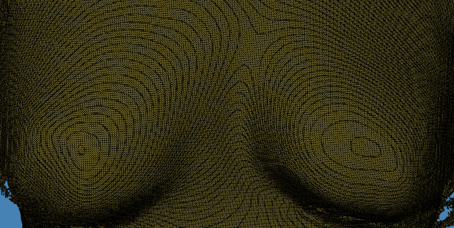
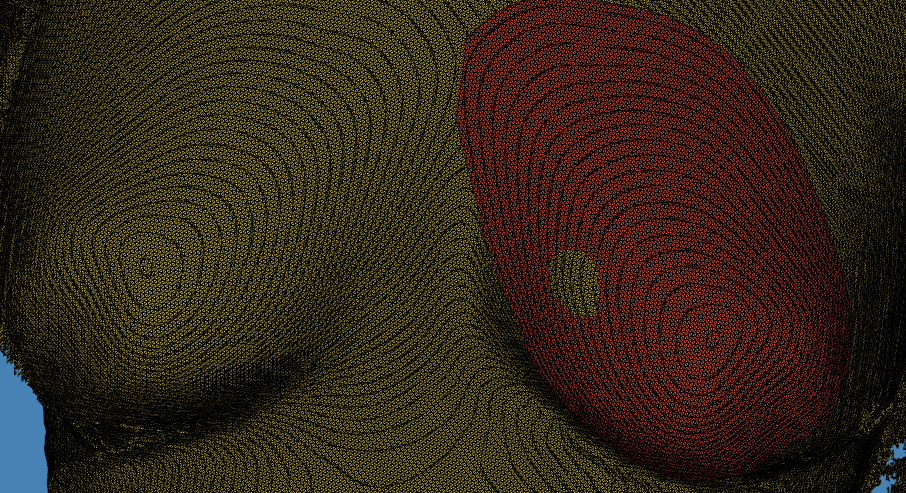

# ONEBra

## English intro

An open source algorithm to generate a 3D model of the women bra. This allows ONEBra to build personalized/customized cups for symmetric breast restoration starting from a simple 3D photo.

## Informations

Want to know more? (contact us)[mailto:santisofia.1992@gmail.com]

## Italian intro

ONEBra propone coppe customizzate, realizzate con stampa 3D per donne con asimmetria ai seni post intervento di mastectomia.
A partire da una semplice foto in 3D del seno creiamo, stampiamo e spediamo a casa un modello 3D personalizzato della coppa per riempire le differenze, sia naturali che a seguito di interventi chirurgici:

 

# Entrepreneurial Team

- Sofia Santi: 8 years of experience in biomaterials, expert in 3D printing
- Giulia Faoro: E-commerce sales manager and businness developer, with 10 years experience in fashon industry
- Silvia Chiera: 8 years of experience in biomaterials and biomedical technologies
- Danilo Tomasoni: Computer Scientist and Bioinformatician with almost 10 years of experience in software engineering and development

# Final product (italian only)

Il prodotto finito consiste in coppe customizzate su misura inserite in un comodo reggiseno (ONEBra).

L'algoritmo per generare le coppe, a partire da una singola foto 3D, è completamente open source, nell'ottica di completa trasparenza verso il cliente e sostenibilità che la startup abbraccia. 

L’articolo viene consegnato a casa tramite un servizio di delivery rapido ed efficiente.

Le coppe sono realizzate con un materiale riciclabile, traspirante e morbido per un fit ad hoc, mentre il reggiseno, che ci viene fornito da un nostro partner commerciale strategico, incontra i parametri di sostenibilità.

In aggiunta, ONEBra garantisce un servizio di community per sostenere le donne durante tutte le fasi dell’intervento di mastectomia attraverso l’ausilio di materiale informativo e di supporto.

# Funding (italian only)

#Onebra è una #startup che partecipa alla terza edizione di [TrentinoStartupValley](https://trentinostartupvalley.it/) 
